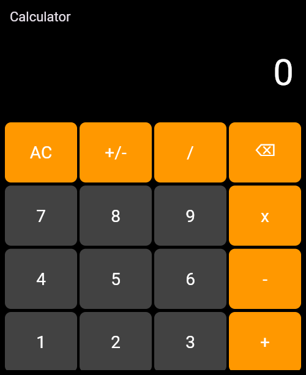

## 🧮 Calculator App

Uma calculadora simples e responsiva desenvolvida em **Flutter**.  
A simple and responsive calculator built with **Flutter**.  

---

## Badges

  
  

---

## 📱 Funcionalidades | Features
- ✅ Layout responsivo: Mobile & Desktop | Responsive layout: Mobile & Desktop  
- ✅ Operações básicas: `+`, `-`, `x`, `/` | Basic operations: `+`, `-`, `x`, `/`  
- ✅ Botões de limpar (AC), apagar (⌫), trocar sinal (+/-) | Clear, delete, and sign change buttons  
- ✅ Tratamento de erros (ex.: divisão por zero) | Error handling (e.g., division by zero)  

---

## 🛠 Tecnologias | Tech Stack
- **Flutter & Dart**  
- **math_expressions** (engine de cálculo | calculation engine)  

---

## 📸 Demonstração | Demo
### Mobile Layout  

---

## Como Executar

[📲 Baixar APK v1.0.0](https://github.com/emanoelsg/calculator/releases/download/v1.0.0/app-release.apk)

